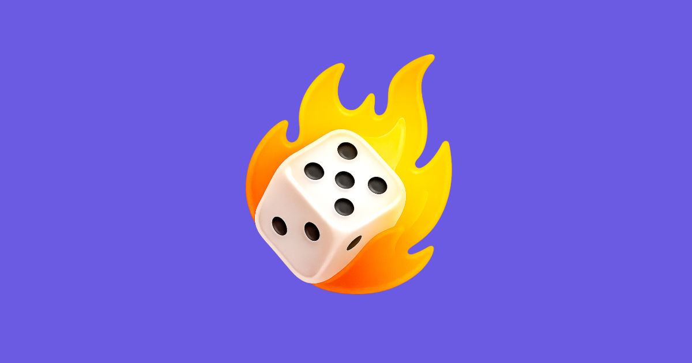

<p align="center">
  
</p>

# Playus Devkit Games

Public starter kit for building small Playus-style web games.

This repo helps external game developers build and test a game before opening a PR. It is not the internal Playus game runtime. Playus will still review, adapt, and integrate accepted games internally.

## Quick Start

```sh
npm install
npm run dev
```

Open the tester at:

```txt
http://localhost:8091
```

The tester can load the included examples or a game running on another local URL.

## Build A Game

Copy the starter:

```txt
games/starter-game -> games/your-game-id
```

Then update:

- `games/your-game-id/index.html`
- `games/your-game-id/src/main.ts`
- `GAME_ID` inside the game

Run an included example:

```sh
npm run dev:starter
npm run dev:phaser
npm run dev:babylon
```

Most existing Playus games use plain JavaScript/TypeScript, Phaser, or Babylon.js. Other web-first frameworks are welcome when they stay lean and perform well in mobile WebViews. See [Assets and mobile performance](docs/assets-and-performance.md).

## The Small Contract

Every game should do this:

```ts
import { playus } from '@playus';

playus.configure({ gameId: 'your-game-id' });

playus.game.ready();          // when required assets are loaded
playus.game.started();        // when the run really starts
playus.game.score(score);     // reasonable live leaderboard updates
playus.game.finished(score);  // final exact score, exactly once
```

If setup fails:

```ts
playus.game.error({ code: 'INIT_FAILED', message: 'Could not load level.' });
```

Do not build your own result screen, upload flow, leaderboard, login, localization system, language switcher, host audio controls, or Playus host integration.

## Examples

- `games/starter-game`: smallest copyable TypeScript starter.
- `games/phaser-example`: Phaser with a small generated target.
- `games/babylon-example`: Babylon.js with a clickable rotating cube.

## Docs

- [Game contract](docs/game-contract.md)
- [Assets and mobile performance](docs/assets-and-performance.md)
- [Submission checklist](docs/submission-checklist.md)
